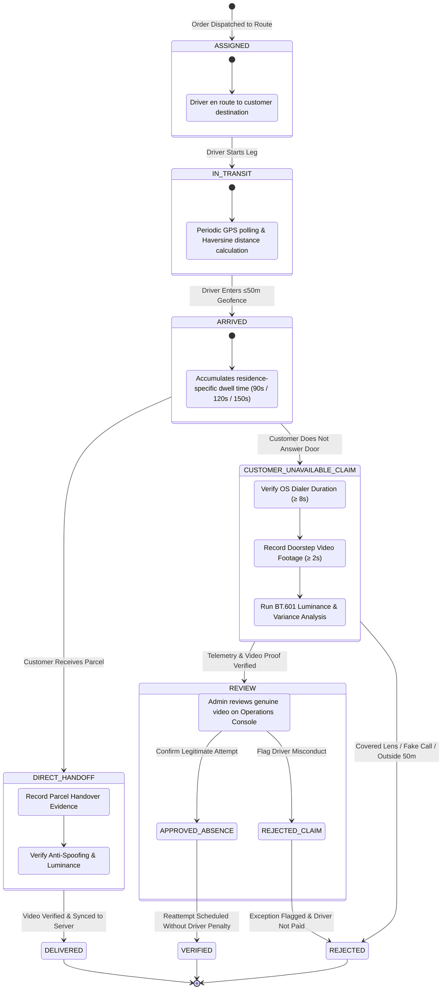

# Saboot — Zero-Trust Delivery Attempt Verification & Anti-Fraud Platform

> **Cryptographic, telemetry-driven proof of delivery attempt for last-mile logistics.** Eliminates fake customer-unavailable claims, protects driver compensation, and provides indisputable delivery audits with authentic video proof.

[](LICENSE)
[](https://docs.expo.dev/versions/v57.0.0/)
[](https://reactnative.dev/)
[](https://www.typescriptlang.org/)
[](https://overturemaps.org/)
[](#10-testing--verification)

---

## Table of Contents
- [1. Executive Summary](#1-executive-summary)
  - [The Last-Mile "Ghost Attempt" Problem](#the-last-mile-ghost-attempt-problem)
  - [The Saboot Solution](#the-saboot-solution)
- [2. System Architecture & Flow Mind Map](#2-system-architecture--flow-mind-map)
  - [End-to-End System Mind Map](#end-to-end-system-mind-map)
  - [Delivery Lifecycle State Machine](#delivery-lifecycle-state-machine)
  - [Zero-Trust Policy Evaluation Matrix](#zero-trust-policy-evaluation-matrix)
- [3. Key Features](#3-key-features)
- [4. Implementation Status](#4-implementation-status)
- [5. Technology Stack](#5-technology-stack)
- [6. Directory Structure](#6-directory-structure)
- [7. Quickstart & Local Setup](#7-quickstart--local-setup)
  - [Prerequisites](#prerequisites)
  - [Installation](#installation)
  - [Running the Admin Operations Console](#running-the-admin-operations-console)
  - [Running the Mobile Driver App](#running-the-mobile-driver-app)
- [8. Real-Time Sync & REST API Reference](#8-real-time-sync--rest-api-reference)
- [9. Anti-Tampering & Telemetry Math](#9-anti-tampering--telemetry-math)
  - [Haversine Proximity Verification](#haversine-proximity-verification)
  - [Residence-Aware Dwell Thresholds](#residence-aware-dwell-thresholds)
  - [Native Telephony Duration Auditing](#native-telephony-duration-auditing)
  - [Video Anti-Spoofing & Luminance Engine](#video-anti-spoofing--luminance-engine)
- [10. Testing & Verification](#10-testing--verification)
- [11. Permissions & Native Manifests](#11-permissions--native-manifests)
- [12. Roadmap](#12-roadmap)
- [13. Contributing & License](#13-contributing--license)

---

## 1. Executive Summary

### The Last-Mile "Ghost Attempt" Problem
In high-density urban logistics (e.g., Bengaluru, Mumbai, Delhi), 15% to 28% of parcel delivery exceptions are logged as **"Customer Unavailable"**, **"Door Locked"**, or **"Address Incomplete"**. 

Historically, dispatch operations have relied on **blind trust** in mobile client checkboxes. This creates massive operational leaks:
1. **Ghost Attempts**: Drivers stranded in traffic or running behind schedule mark packages as "attempted" while miles away from the recipient address.
2. **Fly-By Scans**: Drivers park at a highway or complex entrance, mark 5 orders unavailable within 30 seconds without ever entering the premises or ringing doorbells.
3. **Ghost Calls**: Drivers click "Call Customer" in an app, immediately hang up (< 2 seconds), and claim the customer did not answer.
4. **Covered Lens / Blank Video Tampering**: Drivers cover their smartphone camera with a thumb or record dark pockets to fake video evidence requirements.
5. **Customer Friction & Return-to-Origin (RTO) Costs**: Retailers absorb millions in return freight, restocking fees, and angry customer escalations.

### The Saboot Solution
**Saboot** (*Hindi for "Proof / Irrefutable Evidence"*) replaces subjective driver claims with a **deterministic zero-trust evaluation engine**. The mobile client never decides if an attempt is valid; it submits raw sensory telemetry (GPS breadcrumbs, horizontal dilution of precision, OS call timestamps, pixel luminance arrays, and authentic video clips) to an immutable policy engine.

Every delivery attempt resolves deterministically into one of four states:
- `VERIFIED`: Mandatory proximity (≤ 50m), residence-specific dwell time (90s–150s), and verified telephony contact criteria met.
- `REJECTED`: Falsified attempts (e.g., driver > 500m away, zero call made, covered camera lens).
- `REVIEW`: Ambiguous edge cases (e.g., degraded GPS accuracy ±68m, borderline dwell time) flagged for supervisor inspection.
- `DELIVERED`: Authentic customer doorstep handoff verified by anti-spoof video recording and persisted to local SQLite / backend storage.

---

## 2. System Architecture & Flow Mind Map

### End-to-End System Mind Map

```mermaid
flowchart TD
    %% Styling classes
    classDef mobile fill:#0F172A,stroke:#38BDF8,stroke-width:2px,color:#F8FAFC;
    classDef backend fill:#0F172A,stroke:#22C55E,stroke-width:2px,color:#F8FAFC;
    classDef admin fill:#0F172A,stroke:#F59E0B,stroke-width:2px,color:#F8FAFC;
    classDef storage fill:#1E293B,stroke:#94A3B8,stroke-width:1.5px,color:#E2E8F0;
    classDef decision fill:#1E1B4B,stroke:#818CF8,stroke-width:2px,color:#EEF2FF;

    subgraph MobileDriverApp["📱 Mobile Driver App (Expo SDK 57 / React Native)"]
        Sensors["📡 Hardware Sensors\n(GPS, Gyro, AppState)"]:::mobile --> LocEngine["📍 Location Engine\n(Haversine Distance Math)"]:::mobile
        Dialer["📞 OS Dialer Integration\n(Native Call-Duration Timer)"]:::mobile --> CallAudit["⏱️ Telephony Auditor\n(Minimum 8s Ring Check)"]:::mobile
        Camera["🎥 Camera & File Picker\n(expo-camera / System File Picker)"]:::mobile --> VidVerify["🔍 BT.601 Anti-Spoof Analyzer\n(Luminance, Variance, Min 2.0s)"]:::mobile
        
        LocEngine --> Workflows["📋 Delivery & Absence Workflows\n(useDelivery / useAttestation)"]:::mobile
        CallAudit --> Workflows
        VidVerify --> Workflows
        
        Workflows --> NativeUpload["📤 Native File Streamer\n(expo-file-system/legacy uploadAsync)"]:::mobile
        Workflows --> LocalDB["💾 Local SQLite WAL Database\n(expo-sqlite / Web localStorage)"]:::storage
        Workflows --> RealtimeClient["⚡ Real-Time Sync Client\n(REST API + SSE Listener)"]:::mobile
    end

    subgraph BackendSyncEngine["⚙️ Saboot Sync & Storage Backend (Node.js :3000)"]
        UploadAPI["📥 Multipart Upload Endpoint\n(POST /api/upload)"]:::backend --> RawFileDisk["🗄️ Raw Video Storage\n(admin/data/uploads/<hash>.mp4)"]:::storage
        RawFileDisk --> RangeStreamer["📼 HTTP 206 Partial Content Streamer\n(GET /api/uploads/<hash>.mp4)"]:::backend
        
        RESTGateway["🚪 REST API Gateway\n(/api/deliveries, /api/events)"]:::backend --> PolicyEngine["🛡️ Zero-Trust Policy Engine\n(Deterministic Rules Matrix)"]:::decision
        RESTGateway --> JSONLedger["📑 Immutable Delivery Ledger\n(admin/data/deliveries.json)"]:::storage
        RESTGateway --> SSEBroadcaster["📡 Server-Sent Events Hub\n(/api/events Broadcast)"]:::backend
        RESTGateway --> PollingHub["⏱️ Polling Fallback Hub\n(/api/events/poll)"]:::backend
    end

    subgraph AdminOperationsConsole["🖥️ Admin Operations & Dispatch Console (Web)"]
        LiveMap["🗺️ Overture / Leaflet Map HUD\n(50m Geofences, Breadcrumb Trails)"]:::admin
        TaskQueue["📊 20-Stop Dispatch Queue\n(Live Status Chips, KPI Counters)"]:::admin
        NativePlayer["🎬 Native HTML5 Video Inspector\n(No Canvas / No AI Door Graphic)"]:::admin
        SupervisorAudit["⚖️ Supervisor Audit Actions\n(✓ Verify Delivery | ✕ Flag / Reject)"]:::admin
        
        TaskQueue <--> LiveMap
        TaskQueue --> NativePlayer
        NativePlayer --> SupervisorAudit
    end

    %% Cross-Component Connections
    NativeUpload -->|Multipart Stream\n(Binary MP4 Payload)| UploadAPI
    RealtimeClient <-->|REST Updates & 10s Heartbeat| RESTGateway
    SSEBroadcaster -->|SSE Stream\n(Instant Push)| RealtimeClient
    SSEBroadcaster -->|SSE Stream\n(Live Push)| TaskQueue
    RangeStreamer -->|HTTP 206 Byte Ranges\n(Fluid Seeking & Buffer)| NativePlayer
    SupervisorAudit -->|PUT /api/deliveries/:id\n(Decision Update)| RESTGateway
```

---

### Delivery Lifecycle State Machine



---

### Zero-Trust Policy Evaluation Matrix

```mermaid
flowchart LR
    Start([Raw Attempt Payload]) --> ProxCheck{Driver within 50m?}
    ProxCheck -- No (> 500m) --> FailReject[REJECTED: Remote Attempt]
    ProxCheck -- Yes / Borderline --> DwellCheck{Dwell Time Satisfied?\n(90s House / 120s Apt / 150s Gated)}
    
    DwellCheck -- No & No Call --> FailReject2[REJECTED: No Dwell & No Call]
    DwellCheck -- Insufficient Dwell --> ReviewDwell[REVIEW: Borderline Dwell]
    
    DwellCheck -- Yes --> CallCheck{Call Attempt Verified?\n(Ring Time ≥ 8s)}
    CallCheck -- No --> ReviewCall[REVIEW: Unverified Telephony]
    
    CallCheck -- Yes --> GPSCheck{GPS Accuracy ≤ 30m?}
    GPSCheck -- No (±68m) --> ReviewGPS[REVIEW: Degraded Telemetry]
    GPSCheck -- Yes --> VideoCheck{Video Proof Required?}
    
    VideoCheck -- Yes (Customer Absent) --> VidEval{Video Anti-Spoof Pass?\n(Luminance > 18, Var > 8)}
    VidEval -- Fail (Covered Lens) --> FailRejectVid[REJECTED: Black / Fake Video]
    VidEval -- Pass --> SupervisorQueue[REVIEW: Pending Admin Approval]
    
    VideoCheck -- No (Direct Handoff) --> PassVerified[VERIFIED / DELIVERED]
```

---

## 3. Key Features

### 🛡️ Zero-Trust Attempt Verification
- **Automated Geofence Lock**: Evaluates spherical distance to delivery coordinates using Haversine calculation. Flagged if attempt occurs outside the 50m perimeter.
- **Categorical Dwell Times**: Dwell duration is not one-size-fits-all:
  - *Individual Houses*: 90 seconds.
  - *Apartment Buildings*: 120 seconds.
  - *Gated Societies & Tech Parks*: 150 seconds (accounts for security gate clearance and elevator transit).
- **Native Telephony Duration Auditing**: Integrates with OS app focus lifecycles (`AppState` / window focus) to measure actual time spent in the system dialer. Prevents instant-hangup spoofing by requiring ring durations ≥ 8s.

### 🎥 Authentic Video Evidence & Anti-Spoofing Engine
- **Native `expo-video` Mobile Player**: Integrated with `expo-video` (`VideoView` + `useVideoPlayer`) ensuring seamless hardware-accelerated playback on Android and iOS without blank WebView preview bugs.
- **Pure Native HTML5 Video in Admin Console**: Browser plays the authentic recorded MP4 video stream directly with HTTP 206 Range seeking. No artificial cartoon door simulations, no synthetic peepholes, and no fake cardboard boxes.
- **Streaming Upload Pipeline**: Powered by `expo-file-system/legacy` (`FileSystem.uploadAsync`) to stream camera recordings from private app sandboxes (`file:///data/user/0/...`) directly to the backend.
- **Pixel Luminance & Variance Analysis (ITU-R BT.601)**:
  - Detects covered lens / pocket recordings (`meanLuminance < 18`).
  - Detects overexposed blank ceilings / paper sheets (`meanLuminance > 240` with `stdDev < 12`).
  - Detects solid-color fake recordings (`variance < 8`).
  - Rejects video files shorter than 2.0 seconds.

### 📍 Real-World Forward Geocoding Engine
- **Accurate Address Pinpointing**: Resolves natural language street addresses and apartment complexes (e.g., *"asritha lotus residency HSR Layout"*, *"Koramangala 5th Block"*, *"Electronic City Phase 1"*) into precise geographic coordinates `[latitude, longitude]`.
- **Multi-Tier Resolution Architecture**:
  - *Tier 1 (Live Geocoders)*: Online query to OpenStreetMap Nominatim and Photon geocoding APIs.
  - *Tier 2 (Locality Tokenizer)*: 20+ comprehensive Bengaluru locality dictionaries (HSR Layout, Koramangala, Indiranagar, Whitefield, Electronic City, Bellandur, BTM Layout, Jayanagar, JP Nagar, Marathahalli, Hebbal, Yelahanka, MG Road, Rajajinagar, Malleshwaram, Banashankari, Sarjapur Road, Manyata, Domlur, Richmond Town).
  - *Tier 3 (Deterministic Micro-Offset)*: High-precision cryptographic hash offset ensures unique residential buildings within a layout get realistic, distinct pin coordinates.
- **Instant Admin Preview**: Dispatch modal features instant geocoding status badges and coordinate previews on input blur.

### 📡 Live Driver GPS Telemetry Streaming
- **Real-Time Mobile-to-Dispatch Radar**: Mobile driver application streams live GPS coordinates, heading, and speed directly to the Admin Portal.
- **Battery-Optimized Throttling**: Driver telemetry transmissions are throttled to 2.5-second intervals via `sendDriverLocationTelemetry()` to maximize mobile battery life and minimize network overhead while preserving smooth dispatch tracking.
- **Live Dispatch HUD**:
  - Real-time animated driver truck marker on the Overture map.
  - Driver status indicators: Online status, driver identity, current speed (km/h), and heading.
  - Dynamic Haversine distance calculator measuring real-time physical separation between the moving driver and the active delivery geofence.
- **Server-Sent Events Broadcast**: Instant push of `DRIVER_LOCATION_UPDATE` events over persistent HTTP streams.

### 🗺️ Open-Source Overture Maps Foundation
- **Unified Web & Mobile Map Experience**: Both the Admin Operations Console and the Rider mobile app (`LiveDeliveryMap.tsx`) utilize high-contrast Overture Maps Foundation / Carto Voyager raster and vector tiles.
- **High-Contrast Telemetry Theme**: Sleek dark/silver slate aesthetics designed for operations room monitors and low-light delivery driving.
- **Live Delivery Radar**: Real-time driver pin markers, customer geofence circles (50m), breadcrumb trails, and dynamic distance calculations.

### ⚡ Real-Time Sync & HTTP 206 Streaming Backend
- **Zero-Dependency Core Node.js**: The server runs on standard Node.js APIs (`http`, `fs`, `path`) without heavyweight frameworks or external runtime dependencies.
- **Server-Sent Events (SSE)**: Instant event dispatching between mobile drivers and the dispatch desk.
- **HTTP 206 Partial Content (Range)**: Supports instant seeking, scrub-ahead, and fluid playback of multi-megabyte video evidence.

---

## 4. Implementation Status

| Capability / Component | Status | Verification Detail |
|---|:---:|---|
| **Forward Geocoding Engine** | ✅ Implemented | Multi-tier geocoding (Nominatim + Bengaluru locality tokens) in `admin/server.js`. Verified in `testGeocodingAndTelemetry.js`. |
| **Live Driver Telemetry Stream** | ✅ Implemented | Real-time GPS stream (`POST /api/telemetry` & SSE `DRIVER_LOCATION_UPDATE`) with 2.5s throttle in `useLocationTracking.ts`. |
| **Overture Maps Integration** | ✅ Implemented | 100% open-source Overture Maps Foundation tiles across `admin/app.js` and mobile `LiveDeliveryMap.tsx`. |
| **Haversine Distance Engine** | ✅ Implemented | Tested against close (31m) and remote (3168m) coordinates in `tests/runTests.js`. |
| **Categorical Dwell Calculation** | ✅ Implemented | Validates dwell times from raw breadcrumbs across 90s, 120s, and 150s thresholds. |
| **Native Call-Log Time Tracker** | ✅ Implemented | Tracks elapsed dialer time via `AppState` and window blur/focus events; flags calls < 8s. |
| **Video Anti-Spoofing Analysis** | ✅ Implemented | Evaluates luminance, variance, standard deviation, and duration in `videoVerificationService.ts`. |
| **Native Mobile Video Preview** | ✅ Implemented | Powered by `expo-video` native module; tested on native Android/iOS without WebViews. |
| **Native File Upload Pipeline** | ✅ Implemented | Powered by `expo-file-system/legacy` `uploadAsync` to stream local camera files to server. |
| **Authentic Admin Video Player** | ✅ Implemented | Pure HTML5 `<video>` tag with HTTP 206 Range streaming; zero cartoon door graphics. |
| **Admin Operations Dashboard** | ✅ Implemented | Full dispatch queue, KPI counters, map tracking, driver radar, and video playback in `admin/index.html`. |
| **Bidirectional Sync Server** | ✅ Implemented | Native Node.js HTTP + SSE server on port 3000 (`admin/server.js`) binding `0.0.0.0`. |
| **SQLite WAL Persistence** | ✅ Implemented | Relational schema in `expo-sqlite` (Expo SDK 57) with localStorage fallback on Web. |
| **Pre-Populated Task Dataset** | ✅ Implemented | 20 realistic delivery stops (`DEL-1001` through `DEL-1020`) across Bengaluru. |

---

## 5. Technology Stack

### Mobile Client Application
- **Runtime**: [React Native 0.86.3](https://reactnative.dev/) with [React 19.2.3](https://react.dev/)
- **Framework**: [Expo SDK 57](https://docs.expo.dev/versions/v57.0.0/)
- **Language**: [TypeScript 7.0.2](https://www.typescriptlang.org/)
- **Persistence**: `expo-sqlite` (WAL Mode) with Web `localStorage` abstraction
- **Media & Sensors**: `expo-video`, `expo-file-system/legacy`, `expo-location`, `expo-camera`, `expo-image-picker`, `expo-document-picker`, `expo-haptics`
- **Mapping**: `react-native-maps` (Mobile Native) & HTML5 Canvas / Leaflet (Web)

### Admin Operations Console & Backend Sync
- **Backend Runtime**: Node.js core HTTP (`admin/server.js`) with zero external runtime dependencies
- **Video Storage & Streaming**: Multipart/form-data boundary parser with HTTP 206 Partial Content Range streaming
- **Real-Time Protocol**: Server-Sent Events (SSE `text/event-stream`) + REST HTTP Polling fallback
- **GIS / Mapping**: Leaflet 1.9.4 with Overture Maps Foundation / OpenFreeMap vector tiles
- **Frontend Architecture**: Vanilla ES6+ JavaScript, custom CSS3 design tokens, native HTML5 Video player

---

## 6. Directory Structure

```
Saboot/
├── admin/                           # Admin Operations Console & Sync Server
│   ├── data/
│   │   ├── deliveries.json          # Persisted backend delivery records
│   │   └── uploads/                 # Stored authentic MP4 video evidence files
│   ├── app.js                       # Admin UI logic, Leaflet map, native video player
│   ├── index.html                   # Operations console markup & KPI cards
│   ├── server.js                    # Node.js HTTP + SSE + Video Range server (Port 3000)
│   └── style.css                    # High-contrast silver/slate operations theme
├── assets/                          # Application icons, splash screens, logos
├── src/
│   ├── App.tsx                      # Root screen orchestrator & navigation state
│   ├── components/                  # Reusable UI components
│   │   ├── DeliveryCard.tsx         # Delivery queue card with status chips
│   │   ├── DwellGauge.tsx           # Circular dwell time countdown timer
│   │   ├── EvidenceChecklist.tsx    # Step-by-step physical verification checklist
│   │   ├── Header.tsx               # Top header with driver profile
│   │   ├── LiveDeliveryMap.tsx      # Interactive map with geofence & driver radar
│   │   ├── MetricCard.tsx           # Shift KPI summary cards
│   │   ├── ResultCard.tsx           # Post-verification audit certificate card
│   │   ├── SabootLogo.tsx           # Vector shield branding
│   │   ├── ScenarioModal.tsx        # Hackathon demo scenario switcher
│   │   └── VideoProofThumbnail.tsx  # Native expo-video mobile proof player
│   ├── constants/
│   │   ├── demoData.ts              # 20 complete Bengaluru deliveries (DEL-1001..DEL-1020)
│   │   ├── dwellPolicy.ts           # Residence-specific dwell & proximity limits
│   │   └── theme.ts                 # Color tokens, typography, shadows
│   ├── hooks/
│   │   ├── useAttestation.ts        # Attempt verification workflow hook
│   │   ├── useDelivery.ts           # SQLite sync, 10s ping, and shift metrics hook
│   │   └── useLocationTracking.ts   # GPS breadcrumb recording & Haversine calculator
│   ├── screens/
│   │   ├── DeliveryDetailScreen.tsx # Handoff workflow, camera, call log, file picker
│   │   ├── HomeScreen.tsx           # Route stops list, KPI counters, sync button
│   │   └── ResultScreen.tsx         # Detailed verification audit report
│   ├── services/
│   │   ├── apiService.ts            # Zero-trust deterministic policy evaluation engine
│   │   ├── databaseService.ts       # expo-sqlite WAL database & Web storage adapter
│   │   ├── locationService.ts       # GPS watchPosition & Haversine distance math
│   │   ├── realtimeSync.ts          # REST + SSE client, native FileSystem uploader
│   │   └── videoVerificationService.ts # Video frame analysis & anti-tamper checker
│   └── types/
│       ├── delivery.ts              # Delivery, Address, Customer, ShiftMetrics types
│       ├── evidence.ts              # GPS breadcrumb, CallEvidence, VideoEvidence types
│       └── policy.ts                # VerificationResult, VerificationFacts types
├── tests/                           # Verification & test suites
│   ├── runTests.js                  # Zero-trust policy & spoofing test suite (21 tests)
│   ├── testAdminAndFileManager.js   # Admin controls & file upload tests (4 tests)
│   ├── testCompleteFlow.js          # Comprehensive end-to-end integration test
│   ├── testGeocodingAndTelemetry.js # Forward geocoding & live telemetry test suite (5 tests)
│   ├── testOvertureAndDispatchSync.js # Overture maps & dispatch sync tests (7 tests)
│   ├── testVideoAndSqlite.js        # Video anti-spoof & SQLite tests (9 tests)
│   ├── verifyAdminReviewWorkflow.js # Admin approval and rejection workflow tests
│   └── verifyPhoneToDbToAdmin.js    # Direct Phone -> Backend -> Admin stream verification
├── app.json                         # Expo configuration, plugins & OS permissions
├── package.json                     # Scripts and dependencies
└── tsconfig.json                    # TypeScript compiler configuration
```

---

## 7. Quickstart & Local Setup

### Prerequisites
- **Node.js**: `v18.x` or higher (tested on Node v20/v22/v24)
- **npm** or **yarn**
- **Expo Go** (if running on a physical Android or iOS device)

### Installation
Clone the repository and install dependencies:

```bash
git clone https://github.com/vishnubhargavd/Saboot.git
cd Saboot
npm install
```

### One-Command Start (Admin + Mobile App + QR Code)

To start both the Admin Operations Console and the Expo Metro Bundler with the QR code and LAN URLs displayed simultaneously:

```bash
make start
# or
make dev
```

This will:
1. Detect your machine's active LAN IP address automatically.
2. Launch the Saboot Admin Sync Server on port 3000 (`http://localhost:3000` and `http://<YOUR_LAN_IP>:3000`).
3. Start the Expo Metro Bundler on port 8081 with an interactive terminal QR code for scanning with Expo Go.
4. Cleanly stop both processes when you press `Ctrl+C`.

Other helpful `make` commands:
```bash
make admin    # Run only the Admin Operations Console (port 3000)
make expo     # Run only Expo Metro Bundler with QR code (port 8081)
make test     # Run all verification test suites
make stop     # Kill any processes occupying ports 3000 and 8081
```

---

### Running the Admin Operations Console
Start the sync server and operations dashboard individually:

```bash
npm run admin
```

The console will bind to all network interfaces (`0.0.0.0:3000`):
- **Local Web Console**: [http://localhost:3000](http://localhost:3000)
- **REST API Deliveries**: [http://localhost:3000/api/deliveries](http://localhost:3000/api/deliveries)
- **Real-Time SSE Stream**: [http://localhost:3000/api/events](http://localhost:3000/api/events)
- **Video Upload Endpoint**: `POST http://localhost:3000/api/upload`

### Running the Mobile Driver App
In a separate terminal window, start the Expo development server:

```bash
# Start Expo interactive CLI
npm start

# Or run directly in your desktop browser:
npm run web

# Or target a connected Android device / emulator:
npm run android

# Or target an iOS simulator (macOS required):
npm run ios
```

> **LAN Mobile Device Note**: When running on a physical mobile device via Expo Go, ensure your phone and computer are on the same Wi-Fi network. The app automatically detects your computer's LAN IP via Expo's `scriptURL` and connects to `http://<YOUR-IP>:3000`.

---

## 8. Real-Time Sync & REST API Reference

The Saboot sync engine provides standard REST endpoints, raw file upload endpoints, HTTP 206 streaming, and a Server-Sent Events (SSE) broadcast stream.

### Endpoints

#### `POST /api/upload`
Uploads raw authentic MP4 video proof from mobile client. Supports both standard multipart/form-data and JSON base64 payloads.
```http
POST /api/upload HTTP/1.1
Host: localhost:3000
Content-Type: multipart/form-data; boundary=----WebKitFormBoundary...

------WebKitFormBoundary...
Content-Disposition: form-data; name="file"; filename="proof_1003.mp4"
Content-Type: video/mp4

<BINARY MP4 DATA>
------WebKitFormBoundary...--
```
**Response (200 OK)**:
```json
{
  "success": true,
  "url": "/api/uploads/proof_1003.mp4",
  "fileName": "proof_1003.mp4"
}
```

#### `GET /api/uploads/:filename`
Streams uploaded video files with **HTTP 206 Partial Content (Range)** support, enabling smooth seeking and buffer scrubbing in native HTML5 video players.
```http
GET /api/uploads/proof_1003.mp4 HTTP/1.1
Host: localhost:3000
Range: bytes=0-1048575
```
**Response (206 Partial Content)**:
```http
HTTP/1.1 206 Partial Content
Content-Range: bytes 0-1048575/788493
Accept-Ranges: bytes
Content-Type: video/mp4
Content-Length: 788493
```

#### `GET /api/deliveries`
Returns the complete list of delivery tasks in the active dispatch route.
```http
GET /api/deliveries HTTP/1.1
Host: localhost:3000
```

#### `POST /api/deliveries`
Dispatches a new delivery task to the route. Broadcasts an `ORDER_DISPATCHED` event to all driver apps.

#### `PUT /api/deliveries/:id`
Updates an existing delivery record (e.g. driver reassignment, handoff completion, or supervisor review).

#### `GET /api/geocode?q=<ADDRESS>`
Dynamically forward geocodes a delivery address to precise latitude/longitude coordinates using online geocoding with multi-tier Bengaluru locality fallback.
```http
GET /api/geocode?q=asritha%20lotus%20residency%20HSR%20Layout HTTP/1.1
Host: localhost:3000
```
**Response (200 OK)**:
```json
{
  "query": "asritha lotus residency HSR Layout",
  "coordinates": [12.9118, 77.6378],
  "latitude": 12.9118,
  "longitude": 77.6378,
  "locality": "HSR Layout",
  "source": "locality_database_offset"
}
```

#### `POST /api/telemetry`
Receives live GPS breadcrumbs, heading, and speed streamed from the mobile driver client. Broadcasts real-time position updates to all connected admin consoles via SSE.
```http
POST /api/telemetry HTTP/1.1
Host: localhost:3000
Content-Type: application/json

{
  "driverId": "DRV-8821",
  "driverName": "Rajesh Kumar",
  "latitude": 12.9352,
  "longitude": 77.6245,
  "accuracy": 4.2,
  "speed": 24.5,
  "heading": 85.0
}
```
**Response (200 OK)**:
```json
{
  "success": true,
  "timestamp": 1774152500000
}
```

#### `GET /api/telemetry`
Retrieves the latest active driver telemetry records cached in memory.
```http
GET /api/telemetry HTTP/1.1
Host: localhost:3000
```

#### `GET /api/events` (SSE Stream)
Opens a persistent Server-Sent Events connection. Emits real-time JSON events:
- `ORDER_DISPATCHED`: New order created in admin console.
- `TASK_ASSIGNED`: Driver reassigned.
- `DELIVERY_COMPLETED`: Driver completed handoff with video proof.
- `ADMIN_DECISION_UPDATED`: Supervisor approved or rejected claim.
- `DRIVER_LOCATION_UPDATE`: Live GPS position, speed, and heading emitted by active drivers.

#### `GET /api/events/poll?since=<TIMESTAMP>`
Lightweight polling fallback for network environments where long-lived HTTP SSE connections are interrupted.

---

## 9. Anti-Tampering & Telemetry Math

### Haversine Proximity Verification
To determine distance between the driver's current coordinates $(\phi_1, \lambda_1)$ and the delivery address $(\phi_2, \lambda_2)$, Saboot uses the great-circle Haversine formula on a spherical Earth radius $R = 6,371,000\text{ m}$:

$$\Delta\phi = \frac{(\phi_2 - \phi_1) \cdot \pi}{180}, \quad \Delta\lambda = \frac{(\lambda_2 - \lambda_1) \cdot \pi}{180}$$

$$a = \sin^2\left(\frac{\Delta\phi}{2}\right) + \cos\left(\frac{\phi_1 \cdot \pi}{180}\right) \cdot \cos\left(\frac{\phi_2 \cdot \pi}{180}\right) \cdot \sin^2\left(\frac{\Delta\lambda}{2}\right)$$

$$c = 2 \cdot \text{atan2}\left(\sqrt{a}, \sqrt{1 - a}\right), \quad d = R \cdot c$$

Attempts with $d > 50\text{m}$ (plus GPS jitter tolerance) are blocked from claiming proximity verification.

### Residence-Aware Dwell Thresholds
Dwell time is derived from the timestamps of consecutive breadcrumbs recorded within the $50\text{m}$ geofence:

$$T_{\text{dwell}} = t_{\text{last\_inside}} - t_{\text{first\_inside}}$$

| Residence Category | Minimum Dwell ($T_{\text{dwell}}$) | Operational Rationale |
|---|:---:|---|
| **Individual House** | 90 seconds | Front-gate entry, doorbell ring, waiting at doorstep |
| **Apartment Complex** | 120 seconds | Parking, building intercom, elevator transit |
| **Gated Society / Tech Park** | 150 seconds | Visitor gate register, security guard check, tower navigation |

### Native Telephony Duration Auditing
When the driver taps "Call Customer", the app launches the OS dialer via `tel:` and captures the exact timestamp $T_{\text{dial}}$. When the driver returns to the app (monitored by React Native `AppState` and Web window focus), the return timestamp $T_{\text{return}}$ is recorded:

$$\Delta T_{\text{call}} = T_{\text{return}} - T_{\text{dial}}$$

- $\Delta T_{\text{call}} < 3\text{s}$: Classified as **Canceled / Misclick** (driver never dialed).
- $3\text{s} \le \Delta T_{\text{call}} < 8\text{s}$: Classified as **Premature Hangup** (insufficient ring count, rejected).
- $\Delta T_{\text{call}} \ge 8\text{s}$: Accepted as **Valid Attempt** (`no_answer`, `busy`, or `completed`).

### Video Anti-Spoofing & Luminance Engine
To verify that video evidence contains genuine visual data rather than a covered lens or blank screen, frames are analyzed using the **ITU-R BT.601** perceived luminance formula across sampled pixels:

$$Y_i = 0.299 \cdot R_i + 0.587 \cdot G_i + 0.114 \cdot B_i$$

$$\bar{Y} = \frac{1}{N} \sum_{i=1}^N Y_i, \quad \sigma^2 = \frac{1}{N} \sum_{i=1}^N (Y_i - \bar{Y})^2, \quad \sigma = \sqrt{\sigma^2}$$

- **Covered Lens / Dark Pocket**: $\bar{Y} < 18 \implies \text{REJECTED\_BLACK}$
- **Washed Out / Blank Light**: $\bar{Y} > 240 \text{ and } \sigma < 12 \implies \text{REJECTED\_WHITE}$
- **Static Monochromatic Dummy**: $\sigma < 8 \implies \text{REJECTED\_BLANK}$
- **Duration Check**: $T_{\text{video}} < 2.0\text{s} \implies \text{REJECTED\_TOO\_SHORT}$

---

## 10. Testing & Verification

Saboot includes automated test suites covering telemetry math, zero-trust policy rules, anti-tampering guards, video spoof detection, SQLite persistence, multipart upload, Range streaming, and dispatch synchronization.

### Run All Test Suites

```bash
# 1. Complete Phone -> Database -> Admin Video Streaming Pipeline (End-to-End)
node tests/verifyPhoneToDbToAdmin.js

# 2. Comprehensive System Integration Test
node tests/testCompleteFlow.js

# 3. Real-World Address Geocoding & Live Driver Telemetry Suite (5 tests)
node tests/testGeocodingAndTelemetry.js

# 4. Supervisor Audit Verification & Rejection Workflow (3 tests)
node tests/verifyAdminReviewWorkflow.js

# 5. Zero-Trust Policy & Hackathon Scenarios Suite (21 tests)
node tests/runTests.js

# 6. Video Proof Anti-Spoofing & SQLite Metrics Suite (9 tests)
node tests/testVideoAndSqlite.js

# 7. File Manager & Admin Controls Suite (4 tests)
node tests/testAdminAndFileManager.js

# 8. Overture Maps & Dispatch Real-Time Sync Suite (7 tests)
node tests/testOvertureAndDispatchSync.js
```

### TypeScript & Syntax Verification
```bash
# Type check the mobile application (0 errors)
npx tsc --noEmit

# Syntax check backend servers
node -c admin/server.js && node -c admin/app.js
```

---

## 11. Permissions & Native Manifests

Saboot requests zero unnecessary permissions. All native permissions declared in `app.json` are strictly tied to delivery attempt evidence:

```json
{
  "android": {
    "permissions": [
      "ACCESS_COARSE_LOCATION",
      "ACCESS_FINE_LOCATION",
      "CAMERA",
      "RECORD_AUDIO"
    ]
  },
  "ios": {
    "infoPlist": {
      "NSLocationWhenInUseUsageDescription": "Saboot requires your location to verify delivery proximity and dwell time.",
      "NSCameraUsageDescription": "Saboot uses the camera for customer-consented delivery proof video.",
      "NSMicrophoneUsageDescription": "Saboot uses the microphone for video evidence recording."
    }
  }
}
```

---

## 12. Roadmap

- [x] **Phase 1: Core Zero-Trust Telemetry Engine**: Haversine distance, categorical dwell thresholds, and native telephony audit.
- [x] **Phase 2: Video Anti-Spoofing & Handoff Proof**: ITU-R BT.601 pixel analysis, covered lens detection, and native `expo-video` player.
- [x] **Phase 3: Open-Source Maps Migration**: Migration from Google Maps to Leaflet and Overture Maps Foundation tiles across Web and Mobile.
- [x] **Phase 4: Real-Time Sync & 10s Auto-Ping**: Bi-directional HTTP REST + Server-Sent Events with automated 10-second heartbeat.
- [x] **Phase 5: Authentic Video Streaming Pipeline**: Multipart file uploader, Range 206 streaming, and pure HTML5 admin video player.
- [x] **Phase 6: 20-Stop Bengaluru Route Catalog**: Rich demo dataset with realistic addresses, geofences, and package types.
- [x] **Phase 7: Real-World Forward Geocoding Engine**: Multi-tier dynamic address geocoding with 20+ Bengaluru locality dictionaries and deterministic micro-offsets.
- [x] **Phase 8: Live Driver GPS Telemetry Streaming**: Real-time mobile GPS tracking, SSE position broadcasts, and animated dispatch radar.
- [ ] **Phase 9: Cryptographic BLE Beacon Lock**: Secure handshake with apartment locker gates and building access beacons.
- [ ] **Phase 10: Hardware-Attested KeyStore (Keystore/SecureEnclave)**: Cryptographically sign GPS breadcrumbs with device-bound private keys.

---

## 13. Contributing & License

Contributions are welcome! Please ensure all modifications pass TypeScript checks (`npx tsc --noEmit`) and the full test suite (`node tests/verifyPhoneToDbToAdmin.js && node tests/testCompleteFlow.js`) before opening a pull request.

### License
This project is licensed under the **MIT License** — see the [LICENSE](LICENSE) file for details.
