# Saboot (सबूत) — Zero-Trust Delivery Attempt Verification & Anti-Fraud Platform

> **Cryptographic, telemetry-driven proof of delivery attempt for last-mile logistics.**  
> Eliminates fake "Customer Unavailable" ghost claims, protects driver payouts, and provides indisputable, multi-modal delivery attestation with native video proof and real-time customer QR verification.

[](LICENSE)
[](https://docs.expo.dev/versions/v57.0.0/)
[](https://reactnative.dev/)
[](https://nodejs.org/)
[](https://nodejs.org/api/sqlite.html)
[](https://overturemaps.org/)
[-brightgreen.svg)](#-testing--verification)

---

## 📑 Table of Contents
- [1. Executive Summary & The Problem](#-executive-summary--the-problem)
- [2. System Architecture](#-system-architecture)
- [3. Key Features](#-key-features)
- [4. Implementation Status](#-implementation-status)
- [5. Deterministic Verification Engine](#-deterministic-verification-engine)
- [6. Customer QR Verification Flow](#-customer-qr-verification-flow)
- [7. Technology Stack](#-technology-stack)
- [8. Repository Structure](#-repository-structure)
- [9. Quickstart & Local Setup](#-quickstart--local-setup)
- [10. Real-Time Sync & REST API Reference](#-real-time-sync--rest-api-reference)
- [11. Testing & Verification](#-testing--verification)
- [12. Cloud & Container Deployment](#-cloud--container-deployment)
- [13. Security Architecture](#-security-architecture)
- [14. License](#-license)

---

## 🎯 Executive Summary & The Problem

### The Last-Mile "Ghost Attempt" Crisis
In high-density urban logistics (e.g., Bengaluru, Mumbai, Delhi), **15% to 28% of delivery exceptions** are marked as **"Customer Unavailable"**, **"Door Locked"**, or **"Address Incomplete"**. 

Traditional logistics workflows rely on **blind trust** in mobile client checkboxes. This creates massive operational fraud:
1. **Ghost Attempts**: Drivers stranded in traffic mark parcels "attempted" while miles away from the delivery doorstep.
2. **Fly-By Scans**: Drivers park at complex gates, marking multiple deliveries unavailable in under 30 seconds without stepping foot on the premises.
3. **Ghost Calls**: Drivers click "Call Customer", immediately hang up within 1–2 seconds, and claim the customer failed to answer.
4. **Camera Tampering**: Drivers cover smartphone cameras with thumbs or film dark pockets to fake video evidence requirements.
5. **Return-to-Origin (RTO) Penalties**: Merchants and logistics carriers absorb tens of millions in return freight, wasted labor, restocking expenses, and brand erosion.

### The Saboot Solution
**Saboot** (*Hindi for "Proof / Irrefutable Evidence"*) replaces subjective claims with an **immutable, multi-modal zero-trust attestation engine**. 

The mobile client never decides whether an attempt is valid. Instead, it uploads raw sensory telemetry (GPS breadcrumb arrays, horizontal dilution of precision, OS call duration lifecycles, pixel luminance statistics, and MP4 video proof) to an authoritative policy engine. Every delivery attempt deterministically resolves into one of four verified states:
- `VERIFIED`: Mandatory 50m geofence, residence-specific dwell (90s–150s), and telephony criteria satisfied.
- `REJECTED`: Falsified attempts (e.g., driver > 500m away, zero call made, covered camera lens).
- `REVIEW`: Telemetry ambiguity (e.g., degraded GPS ±68m, borderline dwell) requiring supervisor inspection or customer confirmation.
- `DELIVERED`: Authentic customer doorstep handoff verified by anti-spoof video recording and persisted to ACID storage.

---

## 🏗️ System Architecture

```mermaid
flowchart TD
    classDef mobile fill:#0F172A,stroke:#38BDF8,stroke-width:2px,color:#F8FAFC;
    classDef backend fill:#0F172A,stroke:#22C55E,stroke-width:2px,color:#F8FAFC;
    classDef customer fill:#0F172A,stroke:#F59E0B,stroke-width:2px,color:#F8FAFC;
    classDef storage fill:#1E293B,stroke:#94A3B8,stroke-width:1.5px,color:#E2E8F0;

    subgraph Mobile["📱 Mobile Driver App (Expo SDK 57 / React Native)"]
        Sensors["GPS Sensor & Telephony Tracker"]
        Camera["Native expo-video & Camera Engine"]
        DriverUI["Dwell Gauge & Live Overture Radar"]
        QRGen["QR Token Requester & Live Countdown"]
    end

    subgraph Server["⚡ Saboot Authoritative Backend (Node.js Port 3001)"]
        PolicyEngine["Deterministic Zero-Trust Policy Engine"]
        URLResolver["Authoritative LAN IP & URL Resolver"]
        SSEHub["Server-Sent Events (SSE) Real-Time Hub"]
        AIEngine["Zero-Trust AI Explanation Service (Groq/Llama)"]
        ResendService["Transactional Email Engine (Resend SDK)"]
    end

    subgraph Portal["🌐 Customer Verification Portal (Mobile Browser)"]
        CustomerScan["Native iOS/Android Camera Scan"]
        CustomerUI["Customer Web Portal (/v/:token)"]
        CustomerAction["'I Received' / 'I Did Not Receive'"]
    end

    subgraph DB["💾 Persistence Layer (Node.js SQLite WAL)"]
        Deliveries["deliveries (Orders & States)"]
        Attempts["delivery_attempts (Attempt History)"]
        QRSessions["customer_verification_sessions (Hashed Tokens)"]
        AuditLog["audit_events (Append-Only Immutable Log)"]
    end

    subgraph Admin["🖥️ Admin Operations Console (Web)"]
        AdminMap["Live Overture Telemetry Map"]
        AdminVideo["Native HTML5 MP4 Range Player"]
        AdminActions["Supervisor Approve / Reject Controls"]
    end

    Sensors -->|POST /api/telemetry| Server
    Camera -->|POST /api/upload| Server
    DriverUI -->|POST /api/verify| PolicyEngine
    QRGen -->|POST /customer-verification/qr| URLResolver
    URLResolver -->|256-bit Token Hash| QRSessions
    CustomerScan -->|GET /v/:token| CustomerUI
    CustomerAction -->|POST /confirm| PolicyEngine
    PolicyEngine -->|ACID Transaction| DB
    PolicyEngine -->|Audit Summary| AIEngine
    PolicyEngine -->|Transactional Notice| ResendService
    SSEHub -->|Push Updates| DriverUI
    SSEHub -->|Push Updates| Admin
    AdminActions -->|Supervisor Override| PolicyEngine
```



---

## 🌟 Key Features

### 🛡️ 1. Deterministic Zero-Trust Policy Engine
- **Server Authority**: Client-asserted metrics (`distance`, `dwell`, `decision`) are completely discarded; server re-computes truth from raw GPS coordinates and timestamps.
- **50-Meter Geofence Lock**: Evaluates spherical distance to destination doorstep using the Haversine formula.
- **Residence-Aware Dwell Thresholds**: Dwell requirements scale based on architectural reality:
  - *Individual Houses*: **90 seconds**
  - *Apartment Buildings*: **120 seconds**
  - *Gated Societies & Tech Parks*: **150 seconds** (accounts for security check-in and elevator transit).
- **Native Telephony Duration Auditing**: Integrates with OS app focus lifecycles (`AppState` / window blur-focus) to measure real time spent in the native phone dialer. Prevents instant-hangup spoofing by requiring ring durations ≥ 8 seconds.

### 📱 2. React Native Mobile Driver Application (Expo SDK 57)
- **Live Delivery Radar** (`LiveDeliveryMap.tsx`): Interactive Overture Maps Foundation / OpenFreeMap dark tile view with animated driver truck icon and 50m geofence perimeter.
- **Circular Dwell Gauge** (`DwellGauge.tsx`): Dynamic SVG gauge displaying real-time countdown progress against the active residence requirement.
- **Hardware-Accelerated Video Proof** (`VideoProofThumbnail.tsx`): Native `expo-video` player integration (`VideoView`) ensuring smooth hardware playback without blank WebView glitches.
- **Simulation Scenario Selector** (`ScenarioModal.tsx`): Instantly switch between Hackathon Scenarios A (Genuine Attempt), B (Remote Attempt), and C (Ambiguous Telemetry).

### 🔐 3. Real-Time Customer QR Verification Portal
- **256-Bit Cryptographic Entropy**: Driver app generates single-use URL tokens (`crypto.randomBytes(32).toString('base64url')`).
- **Zero Raw Token Storage**: The raw token is **never** saved to the database. Only its SHA-256 hash is persisted in SQLite.
- **Strict 5-Minute TTL**: Tokens automatically expire after 300 seconds.
- **Atomic Single-Use Replay Protection**: Consumption occurs within an immediate ACID SQLite transaction (`BEGIN IMMEDIATE`). First valid customer response consumes the session; subsequent attempts return HTTP 409 `ALREADY_CONSUMED`.
- **Physical Device LAN Mode**: Automatically resolves the host machine's authoritative non-virtual IPv4 LAN address (`192.168.x.x`), rejecting unroutable loopback addresses (`localhost`/`127.0.0.1`) so physical customer phones can seamlessly connect.

### 🎥 4. Video Anti-Spoofing & Luminance Engine
- **Pixel Luminance & Variance Analysis (ITU-R BT.601)**:
  - Detects covered lens / dark pockets: `meanLuminance < 18`
  - Detects overexposed blank ceilings / paper: `meanLuminance > 240` with `stdDev < 12`
  - Detects solid dummy frames: `variance < 8`
  - Enforces minimum duration: clips must be ≥ 2.0 seconds.
- **Native HTML5 Streaming**: Admin Console plays genuine uploaded MP4 clips with HTTP 206 Partial Content Range streaming. Zero synthetic cartoon simulations.

### 🗺️ 5. Doorstep Geocoding & Interactive Pinpointing
- **Forward Geocoding Engine**: Multi-tier resolution (verified residential complex registry -> live geocoders -> Bengaluru locality tokenizers -> deterministic micro-offsets).
- **Interactive Doorstep Pinpoint Map**: Draggable red doorstep marker (`📍 DOORSTEP`) inside the Dispatch Order modal allowing operations teams to pinpoint entrance gates down to 6 decimal places.

### ⚡ 6. Real-Time Server-Sent Events (SSE)
- Persistent HTTP event streams (`GET /api/events`) with 15-second heartbeats.
- Real-time event propagation: GPS telemetry, customer QR generation, customer QR scan, customer confirmation, supervisor approvals, and new order dispatches reflect instantly across all connected screens with zero page refreshes.

---

## 📊 Implementation Status

| Feature Component | Status | Implementation Details |
| :--- | :---: | :--- |
| **Deterministic Policy Engine** | ✅ Implemented | Server-side Haversine math, residence dwell, telephony validation, and video checks in `admin/server.js`. |
| **Expo Driver Mobile App** | ✅ Implemented | Full React Native / Expo SDK 57 app (`src/`) with live radar, dwell gauge, camera upload, and QR modal. |
| **Customer QR Verification** | ✅ Implemented | 256-bit base64url tokens, SHA-256 hash storage, 5-min TTL, atomic replay protection, and loopback rejection. |
| **Customer Web Portal** | ✅ Implemented | Responsive server-rendered HTML portal (`admin/customerPortal.js`) with receipt cards and security headers. |
| **Admin Operations Console** | ✅ Implemented | Full operations SPA (`admin/index.html`, `app.js`, `style.css`) with Overture map, KPI metrics, and review controls. |
| **SQLite ACID Ledger** | ✅ Implemented | Built-in `node:sqlite` in WAL mode with tables for deliveries, attempts, sessions, and audit events. |
| **Video Anti-Spoofing** | ✅ Implemented | BT.601 pixel luminance, variance, and minimum clip length verification in `videoVerificationService.ts`. |
| **Real-Time SSE Sync** | ✅ Implemented | Zero-dependency HTTP Server-Sent Events with automated 15-second heartbeat and polling fallback. |
| **AI Explanation Service** | ✅ Implemented | Groq / Llama-3.1 explanation assistant with strict PII sanitization and instant deterministic offline fallback. |
| **Transactional Email** | ✅ Implemented | Official Resend SDK integration (`notificationService.js`) with zero-cost demo simulation fallback. |
| **AWS Deployment** | ✅ Implemented | Production multi-stage `Dockerfile`, `apprunner.yaml`, and CloudFormation `aws/template.yaml`. |
| **Driver OAuth Login** | 📋 Planned | Currently uses driver fleet identification headers (`X-Driver-Id`) for seamless hackathon simulation. |

---

## ⚖️ Deterministic Verification Engine

### Policy Rules & Precedence Matrix

```text
Incoming Delivery Attempt
         │
         ▼
[Customer Unavailable Claim?] ── Yes (with Video Proof) ──▶ [REVIEW: Pending Admin Approval & QR Verification]
         │ No
         ▼
[Distance > 500m?] ─────────── Yes ──────────────────────▶ [REJECTED: Severe Geofence Breach]
         │ No
         ▼
[No Call Made AND Dwell Fail?]  Yes ──────────────────────▶ [REJECTED: Insufficient Dwell & Zero Telephony]
         │ No
         ▼
[All Core Criteria Met?] ───── Yes ──────────────────────▶ [VERIFIED: All Criteria Satisfied]
 (≤50m, Dwell OK, Call OK, GPS OK)
         │ No
         ▼
[Degraded GPS Accuracy (>30m)?] Yes ─────────────────────▶ [REVIEW: Telemetry Ambiguity (±68m)]
         │ No
         ▼
[Borderline Dwell Time?] ────── Yes ─────────────────────▶ [REVIEW: Dwell Duration Incomplete]
```

### Residence Dwell Thresholds
```typescript
export const DWELL_POLICY = {
  individual_house: 90,   // 1.5 minutes: Gate to door approach
  apartment: 120,         // 2.0 minutes: Lobby, stairs, elevator transit
  gated_society: 150,     // 2.5 minutes: Security clearance and complex navigation
};
```

---

## 🔄 Customer QR Verification Flow

When an attempt resolves to `REVIEW` (or when a customer is present for doorstep handoff):

1. **Driver Generates QR**: Tapping **"Customer QR Verification"** calls `POST /api/deliveries/:id/customer-verification/qr`.
2. **Backend Token Issuance**:
   - Generates 256-bit cryptographically secure token: `crypto.randomBytes(32).toString('base64url')`.
   - Computes SHA-256 hash: `db.hashToken(rawToken)`.
   - Stores hash in SQLite table `customer_verification_sessions` with `expires_at = now + 300s`. Plaintext token is **never stored**.
   - Resolves authoritative LAN or public URL: `http://192.168.1.2:3001/v/<token>`.
3. **Driver Displays QR**: Rendered crisply on the driver's phone with an active 5-minute countdown.
4. **Customer Scans**:
   - Customer opens camera and navigates to `GET /v/:token`.
   - Server marks session `OPENED` and emits SSE event `CUSTOMER_QR_SCANNED`.
   - Driver app updates live to "Customer Opened Portal".
5. **Customer Submits Response**:
   - Portal displays: **"Did you receive your package?"**
   - Option A: **`📦 I RECEIVED THE PACKAGE`**
     - **CASE 1**: Attempt was `REVIEW` -> Automatically transitions to `VERIFIED`.
     - `requiresAdminApproval` is cleared (`0`); supervisor sign-off is no longer required.
     - Emits SSE event `CUSTOMER_VERIFIED`.
     - Customer browser receives green verified receipt.
   - Option B: **`📦 I DID NOT RECEIVE THE PACKAGE`**
     - **CASE 2**: Transitions to `CUSTOMER_CONFIRMED_FAILURE` and status `RETRY_REQUIRED`.
     - Emits SSE event `CUSTOMER_CONFIRMED_FAILURE`.
     - Flags delivery in Admin Operations Console and queues driver re-attempt task.
6. **Zero-Trust Hard Rule**: If the attempt was physically `REJECTED` (e.g., driver was 3km away), a customer claim **cannot** override the physical evidence. The verdict remains `REJECTED`.

---

## 💻 Technology Stack

### Mobile Frontend (Driver App)
- **Framework**: Expo SDK 57.0.23 / React Native 0.86.3
- **Language**: TypeScript 7.0.2
- **Mapping**: React Native Maps 1.27.2 / React Native WebView 13.16.1 (Overture Maps / Leaflet)
- **Video Player**: Expo Video 57.0.4 (`VideoView`, hardware accelerated)
- **Local Storage**: Expo SQLite 57.0.3 / Expo FileSystem 57.0.7
- **QR Engine**: React Native QRCode SVG 6.3.24 / React Native SVG 15.15.4

### Backend Server & Operations Console
- **Runtime**: Node.js 20 LTS (Zero external HTTP framework dependencies; uses built-in `node:http`, `node:fs`, `node:crypto`)
- **Database**: Node.js built-in `node:sqlite` (`DatabaseSync`) in Write-Ahead Logging (WAL) mode
- **Real-Time**: Server-Sent Events (SSE) with automated 15-second heartbeat
- **Mapping / Tiles**: Leaflet 1.9.4 / Overture Maps Foundation / OpenFreeMap
- **AI Explanation**: Groq Cloud SDK / OpenAI-compatible endpoint (`llama-3.1-8b-instant`)
- **Email Notifications**: Official Resend SDK (`resend` 6.28.1)

---

## 📁 Repository Structure

```text
Saboot/
├── admin/                         # Backend server, APIs, SQLite, & Admin Console
│   ├── app.js                     # Admin Console UI logic & Leaflet Overture map
│   ├── customerPortal.js          # Customer Verification Portal HTML generator
│   ├── index.html                 # Admin Console interface
│   ├── server.js                  # Authoritative HTTP/SSE server (Port 3001)
│   ├── style.css                  # Dark high-contrast operations room stylesheet
│   ├── data/
│   │   ├── seedData.js            # Initial seed delivery fixtures
│   │   ├── saboot.db              # SQLite ACID database (WAL mode, ignored in git)
│   │   └── uploads/               # MP4 video proofs storage (ignored in git)
│   └── services/
│       ├── aiExplanationService.js # LLM explanation service with fallback
│       ├── database.js            # Authoritative SQLite persistence service
│       ├── emailTemplate.js       # Transactional HTML/text email templates
│       └── notificationService.js # Resend email notification service
├── assets/                        # App icons, splash screens, and logos
├── aws/                           # Cloud deployment resources
│   ├── DEPLOYMENT_GUIDE.md        # Complete AWS App Runner & ECS guide
│   └── template.yaml              # AWS CloudFormation App Runner template
├── scripts/
│   └── runQrVerification.js       # Terminal CLI interactive QR verification runner
├── src/                           # Expo / React Native Mobile Driver App
│   ├── App.tsx                    # Root application entry & navigation router
│   ├── components/                # Modular UI components (DwellGauge, Maps, Modals)
│   ├── constants/                 # Dwell policies, demo data, themes
│   ├── hooks/                     # Custom hooks (useDelivery, useAttestation, etc.)
│   ├── screens/                   # HomeScreen, DeliveryDetailScreen, ResultScreen
│   ├── services/                  # Offline SQLite, API client, telemetry sync
│   └── types/                     # Core TypeScript data contracts
├── tests/                         # 16 automated test suites (73+ tests)
├── .env.example                   # Environment variable template
├── app.json                       # Expo SDK 57 project configuration
├── apprunner.yaml                 # AWS App Runner deployment configuration
├── Dockerfile                     # Multi-stage production container build
├── Makefile                       # Developer task runner
└── package.json                   # Project manifest & test scripts
```

---

## 🚀 Quickstart & Local Setup

### Prerequisites
- **Node.js**: `v20.x` or higher (Required for built-in `node:sqlite`)
- **npm**: `v10.x` or higher
- **Expo Go App**: Installed on your iOS or Android smartphone (App Store / Google Play)
- **Local Network**: Smartphone and computer must be connected to the same Wi-Fi network

### Installation
```bash
# Clone the repository
git clone https://github.com/vishnubhargavd/Saboot.git
cd Saboot

# Install dependencies
npm install

# Configure environment variables
cp .env.example .env
```

### Starting the Platform
You can run the full platform using `make` or npm scripts:

```bash
# Option A: Start both Backend Server and Expo Metro Bundler simultaneously
make dev
# or
npm start

# Option B: Run only the Backend & Admin Operations Console (Port 3001)
npm run admin
# or
make admin

# Option C: Run only the Expo Metro Bundler (Port 8081)
npm run start
```

### Accessing the Interfaces
- **Admin Operations Console**: Navigate to `http://localhost:3001` or `http://<YOUR_LAN_IP>:3001` in your browser.
- **Mobile Driver Application**: Scan the Metro QR code displayed in your terminal using the **Expo Go** app on your phone.
- **Customer Verification Portal**: Automatically rendered when scanning a driver-generated QR code or accessing `http://<YOUR_LAN_IP>:3001/v/<token>`.

---

## 📡 Real-Time Sync & REST API Reference

### Core REST Endpoints

| Method | Endpoint | Description |
| :--- | :--- | :--- |
| `GET` | `/api/health` | Service healthcheck returning uptime and timestamp. |
| `GET` | `/api/deliveries` | Retrieve all delivery orders with active statuses and telemetry facts. |
| `POST` | `/api/verify` | Submit raw sensory telemetry for authoritative zero-trust evaluation. |
| `POST` | `/api/upload` | Upload authentic MP4 doorstep video proof. |
| `POST` | `/api/telemetry` | Uplink real-time driver GPS telemetry (lat, lng, speed, heading). |
| `GET` | `/api/geocode?q=<addr>` | Forward geocode street addresses to high-precision doorstep coordinates. |
| `POST` | `/api/deliveries/:id/customer-verification/qr` | Generate a 256-bit secure customer verification QR token. |
| `GET` | `/v/:token` | Serve the responsive Customer Verification Web Portal. |
| `POST` | `/api/customer-verification/token/:token` | Record customer response (`PACKAGE_RECEIVED` or `PACKAGE_NOT_RECEIVED`). |

### Server-Sent Events (SSE) — `GET /api/events`

Connect with header `Accept: text/event-stream` to receive real-time JSON events:
```json
// Example: Live Driver Telemetry
{
  "type": "DRIVER_LOCATION_UPDATE",
  "driverId": "DRV-BLR-09",
  "latitude": 12.912450,
  "longitude": 77.639120,
  "speed": 5.5,
  "heading": 145,
  "timestamp": "2026-09-20T22:00:00.000Z"
}

// Example: Customer QR Scanned
{
  "type": "CUSTOMER_QR_SCANNED",
  "deliveryId": "DEL-1003",
  "scannedAt": "2026-09-20T22:01:15.000Z"
}

// Example: Customer Verification Resolved
{
  "type": "CUSTOMER_VERIFIED",
  "deliveryId": "DEL-1003",
  "status": "VERIFIED",
  "decision": "VERIFIED",
  "customerResponse": "PACKAGE_RECEIVED"
}
```

---

## 🧪 Testing & Verification

The repository contains **16 test files** providing 100% automated coverage over all zero-trust policies, video anti-spoofing algorithms, QR workflows, and database transitions.

```bash
# Run the core Zero-Trust Verification Test Suite (21 tests)
npm test

# Run the complete test suite (73+ tests across 7 comprehensive test suites)
npm run test:all

# Verify TypeScript compilation
npm run typecheck
```

### Test Suite Summary
```text
======================================================
✔ 1. Geocoding & Live Driver Telemetry:    PASSED
✔ 2. Overture Maps & Admin Dispatch Sync:  PASSED (7/7 tests)
✔ 3. Zero-Trust Verification Engine:       PASSED (21/21 tests)
✔ 4. Video Verification & SQLite Metrics:  PASSED (9/9 tests)
✔ 5. Customer Confirmation Portal:         PASSED (11/11 tests)
✔ 6. Open-Source AI Explanation Service:   PASSED (9/9 tests)
✔ 7. Resend Customer Email Notifications:  PASSED (11/11 tests)
======================================================
TOTAL: 73+ / 73+ Tests Passed (100% Success Rate)
```

---

## ☁️ Cloud & Container Deployment

### 🐳 1. Docker Production Build
A multi-stage, lightweight production container definition is provided in `Dockerfile`:
```bash
# Build production container
docker build -t saboot-engine .

# Run container on port 3001
docker run -p 3001:3001 \
  -e PORT=3001 \
  -e PUBLIC_BASE_URL="https://saboot.yourdomain.com" \
  saboot-engine
```

### 🚀 2. AWS App Runner 1-Click Deployment (Recommended)
Saboot includes native configuration for **AWS App Runner** (`apprunner.yaml` and `aws/template.yaml`):
1. Navigate to **AWS App Runner Console** and select **Create service**.
2. Connect your GitHub repository (`feature/saboot-ai-zero-trust` branch).
3. Select **Use configuration file** (`apprunner.yaml` in root).
4. Set environment variables:
   - `PORT`: `3001`
   - `EMAIL_PROVIDER`: `resend` (optional)
   - `RESEND_API_KEY`: `<your-key>` (optional)
   - `PUBLIC_BASE_URL`: `https://<your-service>.awsapprunner.com`
5. Deploy. App Runner automatically provisions SSL/TLS certificates and provides a persistent public HTTPS endpoint for SSE and customer verification.

---

## 🔒 Security Architecture

- **Entropy & Cryptography**: Verification tokens are generated using cryptographically secure pseudorandom numbers (`crypto.randomBytes(32)`).
- **Hashed Token Storage**: The persistent database stores only the SHA-256 hash of tokens. Plaintext tokens are never stored, preventing token harvesting from database backups.
- **Strict Short-Lived TTL**: All customer tokens expire after 300 seconds (5 minutes).
- **ACID Replay Protection**: Single-use token consumption is protected by immediate SQLite transactions (`BEGIN IMMEDIATE`), neutralizing race conditions and double-submission attacks.
- **Physical Device Loopback Protection**: Prevents leaking `localhost` URLs to physical mobile devices scanning QR codes.
- **Security Headers**: Customer portal enforces `X-Content-Type-Options: nosniff`, `X-Frame-Options: DENY`, and `Referrer-Policy: strict-origin-when-cross-origin`.
- **Zero-Trust AI Boundary**: AI is strictly limited to explanatory prose. AI never decides or alters verification outcomes, and all PII is sanitized prior to LLM inference.
- **Server Authority**: The backend recalculates Haversine distance and dwell times from raw breadcrumbs; client-asserted decisions are ignored.

---

## 📄 License

This project is licensed under the MIT License — see the [LICENSE](LICENSE) file for details.
